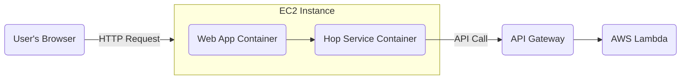

Full-Stack AWS Demo for APM
===========================
This project provides a deployable, multi-tier web application designed to demonstrate Application Performance Monitoring (APM) and distributed tracing across a distributed system on AWS. It consists of a multi-container Python Flask frontend running on EC2, which communicates with a Python backend running on AWS Lambda via an API Gateway.
-   The Lambda is instrumented with the [New Relic Lambda Layer](https://docs.newrelic.com/docs/serverless-function-monitoring/aws-lambda-monitoring/instrument-lambda-function/configure-serverless-aws-monitoring/ "null") provided as a private zip file.
    -   *This method is useful for custom layer versions or in environments where direct access to public AWS layers is restricted.*

The entire infrastructure is defined as code using AWS CloudFormation for easy, repeatable, and automated deployments.

Final Architecture
------------------


Project Structure
-----------------
This is the required folder and file structure for the deployment script to work correctly. Note the placement of the `newrelic-layer.zip` file.

```
.
├── app/                      # The user-facing Flask web application
│   ├── static/
│   ├── templates/
│   ├── main.py
│   ├── Dockerfile
│   └── requirements.txt
├── hop-service/              # The intermediate Flask "hop" service
│   ├── main.py
│   ├── Dockerfile
│   └── requirements.txt
├── lambda/
│   ├── app.py                # The AWS Lambda handler code
│   └── newrelic-layer.zip    # The manually downloaded New Relic layer
├── cloudformation.yaml       # CloudFormation template for all AWS resources
├── deploy.sh                 # Script to automate the entire deployment
├── docker-compose.yml        # Defines the multi-container setup for EC2
└── README.md                 # This guide
```

Deployment Walkthrough
----------------------
Follow these steps precisely to deploy the application from your local machine to your AWS account.

### Step 1: Prerequisites

1.  **AWS Account & CLI**: You must have an AWS account and the [AWS CLI installed and configured](https://docs.aws.amazon.com/cli/latest/userguide/cli-chap-configure.html "null").
    -   **IAM Permissions**: The user or role running the deployment script needs permissions to create the resources defined in `cloudformation.yaml`. Using an `AdministratorAccess` policy is the simplest approach for a demo.
    -   **Verification**: Verify your CLI configuration by running `aws sts get-caller-identity`. This should return your account details without errors.
2.  **S3 Bucket**: Create an S3 bucket in your desired AWS region. This bucket will be used to store deployment artifacts for the Lambda function and layer.
    ```sh
    aws s3 mb s3://cf-templates-<your-account-id>-<your-region>
    ```
    *Example: `aws s3 mb s3://cf-templates-123456789012-us-east-1`*
3.  **EC2 Key Pair**: Create an [EC2 Key Pair](https://docs.aws.amazon.com/AWSEC2/latest/UserGuide/ec2-key-pairs.html "null") in the same region. You will need the key pair's name for the deployment script and the corresponding `.pem` file to access the EC2 instance.
4.  **New Relic Lambda Layer**: Download the New Relic Python Lambda Layer zip file. Rename it to `newrelic-layer.zip` and place it inside the `lambda/` directory of this project. You can list your current key pairs using a command like this:
    ```sh
    aws ec2 describe-key-pairs --region <your-region> --query "KeyPairs[*].KeyName" --output table
    ```
5.  **Local Tools**: Ensure you have `git` and `dig` installed. `dig` is often available via packages like `dnsutils` or `bind-utils`.

### Step 2: Deploy the AWS Infrastructure

This script will provision all the necessary AWS resources, including the Lambda, API Gateway, and the EC2 Instance.
1.  **Make the script executable**:
    ```
    chmod +x deploy.sh
    ```
2.  **Execute the deployment script**: Run the script from your terminal, providing your S3 bucket name, a unique name for this deployment stack, and the name of your EC2 key pair.
    ```
    ./deploy.sh --bucket YOUR_S3_BUCKET_NAME --stack YOUR_STACK_NAME --key-pair YOUR_KEY_PAIR_NAME
    ```
    The script will automatically detect your public IP to secure SSH access and will wait for the entire CloudFormation stack to be deployed.
3.  **Collect the Outputs**: When the script completes, it will display a table of outputs. **Copy the `ApiGatewayEndpoint` and the `EC2PublicIp` values**, as you will need them in the next step.

### Step 3: Configure and Run Frontend Services on EC2

Now, you will connect to the newly created EC2 instance to set up and run the frontend containers.
1.  **SSH into the EC2 Instance**: Use the `.pem` file for your key pair and the `EC2PublicIp` from the script's output. The username for the Ubuntu instance is `ubuntu`.
    ```
    ssh -i /path/to/your-key.pem ubuntu@<EC2PublicIp>
    ```
2.  **Clone the Project Directory on the EC2 Instance**: Once connected via SSH, you need to get the project files. Since this project lives in a subdirectory of a larger repository, using `git sparse-checkout` is the most efficient way to download only the necessary files.
    ```
    # Clone the repository structure without downloading all the files
    git clone --filter=blob:none --no-checkout https://github.com/newrelic/demo-apps.git
    cd apm-lambda-convergence
    
    # Configure git to only pull the specific project directory
    git sparse-checkout init --cone
    git sparse-checkout set apm-lambda-convergence
    
    # Finally, pull down the files for only that directory
    git checkout main
    
    # Navigate into the project directory
    cd apm-lambda-convergence
    ```
    This process ensures that only the `apm-lambda-convergence` directory is downloaded to the EC2 instance, saving time and disk space.
3.  **Configure the API Gateway URL**: You need to tell the `hop-service` the URL of the deployed backend by setting the `API_GATEWAY_URL` variable in the EC2 instance.
    ```sh
    export API_GATEWAY_URL="<Paste the ApiGatewayEndpoint URL here>"
    ```
4. **Provide your New Relic License Key**: You need to give the containers the license key for your New Relic account by setting the `NEW_RELIC_LICENSE_KEY` variable in the EC2 instance.
    ```sh
    export NEW_RELIC_LICENSE_KEY="<Paste your license key here>"
    ```
5.  **Run the Docker Containers**: With the configuration saved, start the services using Docker Compose.
    ```
    sudo docker-compose up --build -d
    ```

### Step 4: Access and Use the Application
The application is now fully deployed and running in the cloud.
1.  **Access the Web UI**: Open your local web browser and navigate to the public IP of your EC2 instance on port 8000: `http://<EC2PublicIp>:8000`
2.  **Use the UI**:
    -   Click **"Invoke Success"** or **"Invoke Error"** to send single requests through the entire stack.
    -   Observe the response from the Lambda function displayed on the page.

Tearing Down the Stack
----------------------
To avoid ongoing AWS charges, you must delete all the created resources.
1.  **Delete the CloudFormation Stack**: This is the primary cleanup step and will remove all resources created by the template (EC2 instance, Lambda, API Gateway, IAM roles, etc.). Replace `YOUR_STACK_NAME` with the name you provided during deployment.
    ```
    aws cloudformation delete-stack --stack-name YOUR_STACK_NAME
    ```
2.  **Delete the S3 Bucket Contents**: The CloudFormation stack deletion will not remove the S3 bucket if it's not empty. You should manually delete the `lambda_package.zip` and `newrelic-layer.zip` files from your S3 bucket.
