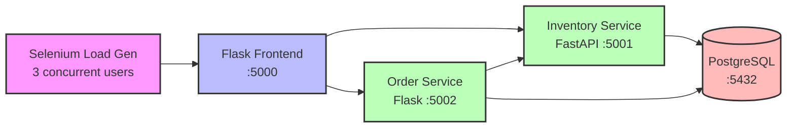

# Bad Apples Orchard

A Python microservices ecommerce application for an apple orchard shop. Built with Flask, FastAPI, and PostgreSQL.

> **Note**: For demo/training purposes, see [DEMO.md](DEMO.md) for observability patterns and New Relic integration details.

## Overview

**Bad Apples Orchard** is a multi-service ecommerce platform for selling fresh apples online. The application consists of a customer-facing web frontend, inventory management API, order processing service, and automated load generation for testing.

### Technology Stack

- **Python** - Flask (frontend & orders), FastAPI (inventory)
- **PostgreSQL** - Relational database
- **Docker Compose** - Container orchestration
- **Selenium** - Automated testing/load generation
- **New Relic APM** - Application monitoring

## Architecture



### Services

- **Flask Frontend** (port 5000) - Customer-facing web shop with shopping cart and checkout
- **Inventory Service** (port 5001) - Product catalog API (FastAPI)
- **Order Service** (port 5002) - Order processing and fulfillment
- **PostgreSQL** (port 5432) - Shared database
- **Selenium Load Generator** - Automated traffic generation for testing

## Prerequisites

- **Docker Desktop** with 4GB+ memory allocated
  - Compatible with Apple Silicon (M1/M2/M3) and x86_64
  - Architecture detection is automatic
- **New Relic Account** (optional, for monitoring)
  - [Sign up free](https://newrelic.com/signup)
  - Get license key from [API Keys UI](https://one.newrelic.com/launcher/api-keys-ui.api-keys-launcher)

## Quick Start

### 1. Check Open Ports

Ensure these ports are available:
- **5000** - Flask Frontend
- **5001** - Inventory Service
- **5002** - Order Service
- **5432** - PostgreSQL Database

```bash
# macOS/Linux - check for port conflicts
lsof -i :5000 -i :5001 -i :5002 -i :5432
```

If ports are in use, either stop the conflicting service or configure alternative ports in `.env` (see below).

### 2. Clone and Configure

```bash
cd /path/to/bad-apples
cp .env.example .env
```

Edit `.env` and configure:

**Required (if using New Relic):**
```bash
NEW_RELIC_LICENSE_KEY=your_actual_license_key_here
```

**Optional - Custom Ports:**
```bash
FRONTEND_PORT=5000
INVENTORY_PORT=5001
ORDER_PORT=5002
POSTGRES_PORT=5432
```

### 3. Start Services

**Development mode** (5 varieties, 3 orders):
```bash
docker-compose up --build -d
```

**Production mode** (8 varieties, 1000+ orders):
```bash
SEED_MODE=production docker-compose up --build -d
```

### 4. Verify Services

```bash
# Check all containers are running
docker-compose ps

# Check service health
curl http://localhost:5000/health  # Frontend
curl http://localhost:5001/health  # Inventory
curl http://localhost:5002/health  # Orders
```

### 5. Access the Application

Open your browser to [http://localhost:5000](http://localhost:5000)

The Selenium load generator will automatically start creating traffic within 30 seconds.

## Usage

### Shopping Experience

1. **Browse Catalog** - View all apple varieties with pricing and stock levels
2. **Add to Cart** - Select quantities (in pounds) and add items
3. **Checkout** - Provide customer information and delivery address
4. **Order Confirmation** - View order details and order number

### API Endpoints

#### Frontend Service (port 5000)

- `GET /` - Homepage
- `GET /catalog` - Product catalog
- `GET /cart` - Shopping cart
- `GET /checkout` - Checkout page
- `POST /api/cart/add` - Add item to cart
- `POST /api/checkout` - Process order
- `GET /health` - Health check

#### Inventory Service (port 5001)

- `GET /api/varieties` - List all apple varieties
- `GET /api/varieties/{id}` - Get single variety details
- `GET /api/varieties/{id}/stock` - Check stock level
- `GET /api/orders/recent?limit=50` - Recent orders with items
- `GET /health` - Health check

#### Order Service (port 5002)

- `POST /api/orders` - Create new order
- `GET /api/orders` - List all orders
- `GET /api/orders/{id}` - Get order details
- `GET /api/stats` - Service statistics
- `GET /health` - Health check

### Environment Variables

Configure via `.env` file:

```bash
# Ports
FRONTEND_PORT=5000
INVENTORY_PORT=5001
ORDER_PORT=5002
POSTGRES_PORT=5432

# Database
POSTGRES_DB=orchard_db
POSTGRES_USER=orchard_user
POSTGRES_PASSWORD=orchard_pass

# Seed Mode
SEED_MODE=development     # or production

# New Relic (optional)
NEW_RELIC_LICENSE_KEY=your_license_key
NEW_RELIC_APP_NAME_FRONTEND=bad-apples_frontend
NEW_RELIC_APP_NAME_INVENTORY=bad-apples_inventory
NEW_RELIC_APP_NAME_ORDERS=bad-apples_orders

# Flask
FLASK_SECRET_KEY=your-secret-key-change-in-production

# Selenium Load Generation
SELENIUM_USERS=3              # Number of concurrent users
SELENIUM_REQUEST_INTERVAL=5   # Seconds between requests
```

## Project Structure

```
bad-apples/
├── docker-compose.yml           # Service orchestration
├── .env.example                 # Environment configuration template
├── README.md                    # This file
├── DEMO.md                      # Demo guide and observability patterns
│
├── database/
│   ├── init.sql                 # PostgreSQL schema
│   └── seed.sh                  # Data seeding script
│
├── flask-frontend/              # Customer-facing web application
│   ├── Dockerfile
│   ├── requirements.txt
│   ├── newrelic.ini
│   ├── app.py                   # Main Flask application
│   ├── wsgi.py
│   ├── templates/               # Jinja2 HTML templates
│   │   ├── base.html
│   │   ├── index.html
│   │   ├── catalog.html
│   │   ├── checkout.html
│   │   └── order_confirmation.html
│   └── static/
│       ├── css/style.css
│       └── js/cart.js
│
├── inventory-service/           # Product catalog API (FastAPI)
│   ├── Dockerfile
│   ├── requirements.txt
│   ├── newrelic.ini
│   ├── app.py                   # FastAPI application
│   └── database.py              # Database connection pool
│
├── order-service/               # Order processing API (Flask)
│   ├── Dockerfile
│   ├── requirements.txt
│   ├── newrelic.ini
│   ├── app.py                   # Flask application
│   ├── wsgi.py
│   └── database.py              # Database utilities
│
└── selenium-load-gen/           # Automated traffic generation
    ├── Dockerfile
    ├── requirements.txt
    ├── load_gen.py              # Main load generator
    └── journeys.py              # User journey definitions
```

## Development

### Running Locally

```bash
# Start all services
docker-compose up --build

# View logs
docker-compose logs -f

# View specific service logs
docker-compose logs -f flask-frontend
docker-compose logs -f inventory-service
docker-compose logs -f order-service
```

### Database Access

```bash
# Connect to PostgreSQL
docker-compose exec postgres psql -U orchard_user -d orchard_db

# Example queries
SELECT COUNT(*) FROM orders;
SELECT * FROM apple_varieties;
SELECT * FROM order_items WHERE order_id = 1;
```

### Rebuild Services

```bash
# Rebuild specific service
docker-compose up -d --build flask-frontend

# Rebuild all services
docker-compose up -d --build
```

## Troubleshooting

### Port Already Allocated Error

**Error:** `Bind for 0.0.0.0:5432 failed: port is already allocated`

**Solution 1: Find and stop the conflicting service**
```bash
# Find what's using the port
lsof -i :5432

# Stop the service (example for PostgreSQL on macOS)
brew services stop postgresql
```

**Solution 2: Use different ports**

Edit `.env`:
```bash
POSTGRES_PORT=5433
FRONTEND_PORT=8000
INVENTORY_PORT=8001
ORDER_PORT=8002
```

Then rebuild:
```bash
docker-compose down
docker-compose up --build -d
```

### Containers Won't Start

Check logs:
```bash
docker-compose logs [service-name]
```

Common issues:
- Missing `.env` file → Copy from `.env.example`
- Invalid New Relic license key (if used)
- Port conflicts → See "Port Already Allocated Error" above

### Database Connection Issues

Wait for health checks:
```bash
docker-compose ps
```

All services should show "healthy" status. If not:

```bash
# Restart services
docker-compose restart

# Or rebuild if needed
docker-compose down
docker-compose up --build
```

### Selenium Not Generating Traffic

Check Selenium logs:
```bash
docker-compose logs selenium-load-gen
```

Common issues:
- Frontend not ready yet → Wait 30-60 seconds after startup
- Chrome/ChromeDriver issues → Check Dockerfile versions

Manual restart:
```bash
docker-compose restart selenium-load-gen
```

### No Data in New Relic

Verify license key:
```bash
docker-compose exec flask-frontend env | grep NEW_RELIC_LICENSE_KEY
```

Check agent logs:
```bash
docker-compose logs flask-frontend | grep -i "new relic"
```

Wait time:
- Initial data appears in 1-2 minutes
- Full distributed traces need 3-5 minutes

### Production Mode Issues

If seed script takes too long (>5 minutes):

```bash
# Stop and start fresh
docker-compose down -v
SEED_MODE=production docker-compose up --build -d

# Monitor seed progress
docker-compose logs -f postgres
```

## Cleanup

### Stop Services (Keep Data)

```bash
docker-compose down
```

### Stop Services and Remove Data

```bash
docker-compose down -v
```

### Remove Everything (Including Images)

```bash
docker-compose down -v --rmi all
```

### Start Fresh

```bash
# Clean slate
docker-compose down -v --rmi all

# Rebuild and start
docker-compose up --build -d
```

## Monitoring

This application is instrumented with New Relic APM for observability:

- **APM**: All three Python services
- **Browser Monitoring**: Frontend (auto-instrumented)
- **Distributed Tracing**: W3C trace context across services
- **Logs in Context**: Application logs forwarded to New Relic
- **Custom User Tracking**: Browser sessions tracked with `newrelic.setUserId()`

For monitoring setup and observability patterns, see [DEMO.md](DEMO.md).

## Configuration

### Seed Modes

**Development** (default):
- 5 apple varieties
- 3 sample orders
- Fast queries
- Best for quick testing

**Production**:
- 8 apple varieties
- 1000+ orders
- Realistic data volumes
- Best for performance testing

Switch modes by setting `SEED_MODE` in `.env` or via environment variable:

```bash
SEED_MODE=production docker-compose up -d
```

### Load Generation

Adjust Selenium traffic generation:

```bash
SELENIUM_USERS=5              # More concurrent users
SELENIUM_REQUEST_INTERVAL=3   # Faster request intervals
```

## License

This project is provided as-is for educational and demonstration purposes.

## Contributing

Contributions welcome! Please feel free to submit pull requests or open issues.

---

**For observability patterns and New Relic integration details, see [DEMO.md](DEMO.md)**
