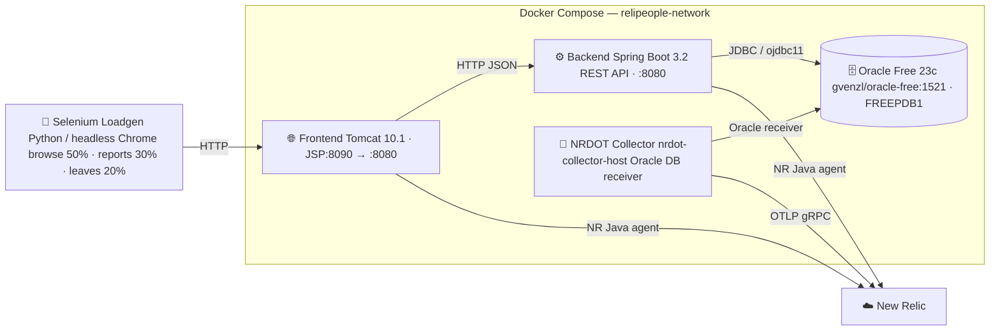

# ReliPeople: Oracle DB Monitoring Demo

A self-contained enterprise HR self-service portal designed to showcase **New Relic Oracle Database monitoring**. The app runs a realistic Java stack — Tomcat/JSP frontend, Spring Boot REST backend, Oracle Free 23c database — and seeds over 500,000 rows across seven tables so that the included slow queries produce interesting execution plans and wait events from the moment you start it.

New Relic instrumentation includes:
- **NR Java agent** on the frontend and backend — APM traces, logs-in-context, distributed tracing
- **NRDOT collector** (`nrdot-collector-host`) scraping Oracle DB metrics directly via the Oracle DB receiver

---

## Architecture



| Service | Image / Base | Role |
|---|---|---|
| `oracle` | `gvenzl/oracle-free:latest` | Oracle Free 23c, schema `relipeople` in FREEPDB1 |
| `backend` | `eclipse-temurin:17-jre` | Spring Boot REST API, JdbcTemplate + HikariCP |
| `frontend` | `tomcat:10.1-jdk17` | WAR deployed as ROOT, JSPs compiled by Jasper |
| `loadgen` | `python:3.11-slim` | Selenium + headless Chromium, continuous load |
| `otel-collector` | `debian:bookworm-slim` + NRDOT | Oracle DB receiver → New Relic OTLP |

---

## Slow Queries

All tables are seeded with 500k+ total rows and **no indexes on foreign-key columns** — every join is a full table scan. This is intentional: it surfaces wait events and execution plans representative of under-tuned enterprise Oracle workloads.

| Endpoint | Query shape | Why it's slow |
|---|---|---|
| `GET /employees?search=` | `LIKE '%term%'` + 4-table JOIN | Wildcard prefix prevents index use; 50k employee rows |
| `GET /reports/payroll` | CTE + `LAG` / `AVG OVER PARTITION BY` | Window sort over 200k salary history rows + 4-table JOIN |
| `GET /reports/departments` | `GROUP BY ROLLUP` + correlated subquery | Correlated `MAX(effective_date)` runs per-employee |
| `GET /reports/performance` | 3-dimension `GROUP BY ROLLUP` | 150k review rows × 3-table JOIN; rollup on year + dept + role |
| `GET /reports/leave-backlog` | Correlated subquery × 50 departments | Each department fires a full scan of 100k leave rows |
| `GET /reports/salary-progression` | Full hash join 50k × 200k rows | Oracle must aggregate all salary rows before sorting top-500 |
| `GET /leaves` | Multi-table JOIN + `TRUNC(end_date - start_date)` | Function on column prevents index seek; 100k leave rows |

---

## Directory Structure

```
oracle-db/
├── .env.example                      # Copy to .env before first run
├── docker-compose.yml
│
├── oracle/
│   └── init/
│       ├── 01-schema.sh              # DDL — 7 tables, no FK indexes (intentional)
│       ├── 02-seed.sh                # 500k+ rows via CONNECT BY LEVEL
│       └── 03-monitoring-user.sql    # c##nrdot CDB user + grants for NRDOT receiver
│
├── otel/
│   ├── Dockerfile                    # Debian + nrdot-collector-host .deb (ARM64)
│   ├── config.yaml                   # Oracle DB receiver + OTLP export pipeline
│   └── internal-telemetry.yaml       # Collector self-monitoring → New Relic
│
├── backend/                          # Spring Boot 3.2 JAR
│   ├── Dockerfile
│   ├── newrelic.yml                  # NR Java agent config
│   ├── pom.xml
│   └── src/main/
│       ├── java/com/newrelic/demo/relipeople/
│       │   └── controller/
│       │       ├── DashboardController.java
│       │       ├── EmployeeController.java
│       │       ├── ReportController.java
│       │       └── LeaveController.java
│       └── resources/
│           └── application.properties
│
├── frontend/                         # Tomcat 10.1 WAR (Jasper compiles JSPs)
│   ├── Dockerfile
│   ├── newrelic.yml                  # NR Java agent config
│   ├── pom.xml
│   └── src/main/
│       ├── java/com/newrelic/demo/relipeople/frontend/servlet/
│       └── webapp/jsp/               # dashboard, employees, profile, reports, leaves
│
└── loadgen/                          # Selenium load generator
    ├── Dockerfile
    ├── load_gen.py                   # Thread orchestration
    ├── journeys.py                   # Per-journey Selenium logic
    └── requirements.txt
```

---

## Prerequisites

- [Docker Desktop](https://www.docker.com/products/docker-desktop/) (or Docker Engine + Compose v2)
- At least **4 GB of RAM** allocated to Docker — Oracle Free requires ~2 GB on its own
- Ports `1521`, `8080`, and `8090` free on your host (configurable in `.env`)
- A **New Relic license key** (ingest key) — the stack will run without one, but telemetry won't reach New Relic

No JDK, Maven, Python, or Oracle client installation is required; everything runs inside containers.

---

## Quick Start

**1. Clone and enter the directory**

```bash
git clone https://github.com/newrelic/demo-apps.git
cd demo-apps/oracle-db
```

**2. Configure environment**

```bash
cp .env.example .env
cp backend/newrelic.yml.example backend/newrelic.yml
cp frontend/newrelic.yml.example frontend/newrelic.yml
```

Open `.env` and set `NEW_RELIC_LICENSE_KEY` to your New Relic ingest license key. All other defaults work out of the box.

> **EU accounts:** also set `NR_OTLP_ENDPOINT=otlp.eu01.nr-data.net:443` in `.env`.

**3. Build and start**

```bash
docker compose up --build
```

The first run downloads base images, compiles both Maven projects, and installs the Oracle DB receiver. Expect **8–12 minutes** before all services are healthy.

> **Oracle Free startup is the gating factor.** The database takes 3–5 minutes to initialize, run schema and seed scripts, and pass its healthcheck. The backend waits for Oracle, the frontend waits for the backend, and the loadgen waits for the frontend.

(Optional) Watch startup progress:

```bash
docker compose logs -f oracle          # wait for "DATABASE IS READY TO USE!"
docker compose logs -f backend         # wait for "Started ReliPeopleApplication"
docker compose logs -f frontend        # wait for Tomcat deployment log
docker compose logs -f otel-collector  # wait for "Everything is ready"
docker compose logs -f loadgen         # should see "Frontend is ready" then journey logs
```

**4. Open the portal**

```
http://localhost:8090
```

---

## Pages & Slow Query Triggers

| URL | What it does |
|---|---|
| `/` | Dashboard — fast summary queries |
| `/employees` | Directory search — type a partial name to trigger the LIKE scan |
| `/employees/{id}` | Employee profile + salary history |
| `/reports/payroll` | **Slow** — CTE + window functions; expect 5–30 s |
| `/reports/departments` | ROLLUP + correlated subquery |
| `/reports/performance` | 3-dimension ROLLUP across 150k review rows |
| `/reports/leave-backlog` | **Slow** — correlated subquery per department, full scans |
| `/reports/salary-progression` | **Slow** — full 200k-row hash join before sort |
| `/leaves` | Leave requests — filter by status |

The Selenium loadgen drives all of these automatically, but you can also hit the backend API directly:

```bash
curl "http://localhost:8080/api/reports/payroll?limit=100"
curl "http://localhost:8080/api/reports/leave-backlog"
curl "http://localhost:8080/api/reports/salary-progression"
curl "http://localhost:8080/api/employees?search=smith&size=20"
```

---

## Environment Variables

| Variable | Default | Description |
|---|---|---|
| `FRONTEND_PORT` | `8090` | Host port for the Tomcat frontend |
| `BACKEND_PORT` | `8080` | Host port for the Spring Boot backend |
| `ORACLE_PORT` | `1521` | Host port for Oracle |
| `ORACLE_PASSWORD` | `ReliPeople1` | SYS / SYSTEM password |
| `ORACLE_APP_USER` | `relipeople` | Application schema owner |
| `ORACLE_APP_PASSWORD` | `ReliPeople1` | Application schema password |
| `NEW_RELIC_LICENSE_KEY` | _(empty)_ | New Relic ingest license key — **required for telemetry** |
| `NEW_RELIC_APP_NAME_FRONTEND` | `relipeople_frontend` | APM entity name for the Tomcat service |
| `NEW_RELIC_APP_NAME_BACKEND` | `relipeople_backend` | APM entity name for the Spring Boot service |
| `NR_OTLP_ENDPOINT` | `otlp.nr-data.net:443` | NRDOT OTLP ingest; EU: `otlp.eu01.nr-data.net:443` |
| `NRDOT_SERVICE_NAME` | `relipeople-nrdot` | Entity name for the NRDOT collector in New Relic |
| `ORACLE_NRDOT_PASSWORD` | `NrdotMonitor1` | Password for the `c##nrdot` monitoring user |
| `INTERNAL_TELEMETRY_METRICS_LEVEL` | `normal` | NRDOT self-monitoring verbosity: `normal` \| `detailed` \| `none` |
| `LOADGEN_USERS` | `2` | Concurrent Selenium user threads |
| `LOADGEN_INTERVAL` | `8` | Seconds between journeys per user (±2 s jitter) |

---

## Optional: Oracle DB Entity Linking

> Highly encouraged — this step connects your APM service traces directly to the Oracle DB entity in New Relic, enabling the "Service → Database" relationship view.

Once the stack has been running for ~5 minutes and the backend and frontend services appear in **New Relic APM**, enable SQL comment tagging so the Oracle DB receiver can link query data back to those services:

**1. Uncomment the `transaction_tracer` block** in both `backend/newrelic.yml` and `frontend/newrelic.yml`:

```yaml
transaction_tracer:
  sql_metadata_comments: "apm_service_entity_guid"
```

**2. Restart the Java services:**

```bash
docker compose restart backend frontend
```

The agent will now prepend `/*nr_service_guid=<entity-guid>*/` to every SQL statement. New Relic's Oracle DB receiver reads that comment from `V$SQL` and draws the relationship. Allow **5–10 minutes** for it to appear in the entity map.

---

## Cleanup

Stop and remove containers:

```bash
docker compose down
```

Remove containers **and** the Oracle data volume (full reset, triggers re-seed on next start):

```bash
docker compose down -v
```
