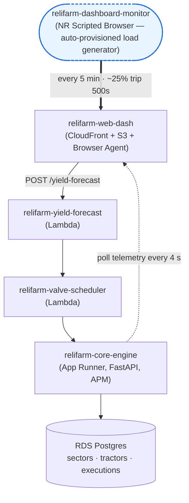

# ReliFarm — Commercial Smart Farm Management

ReliFarm is a self-contained, end-to-end demo application that exercises every
major surface of the New Relic platform — APM, Lambda Layers, Browser Agent,
Distributed Tracing, Logs in Context, Synthetic Monitors, and Errors Inbox —
through a realistic distributed automated-farming workload. All farm telemetry
(soil moisture, temperature, valve state, tractor coordinates) is generated by
local mathematical simulation; no third-party weather or SaaS APIs are called.



**What each component represents in customer terms:**

* **`web-dash`** — the operator-facing web app a farm manager uses to monitor
  fields and trigger irrigation. Instrumented with the **NR Browser Agent**
  (real-user monitoring + distributed tracing on every `fetch`).
* **`yield-forecast` / `valve-scheduler`** — two AWS Lambdas behind API
  Gateway that handle the irrigation request chain. Auto-instrumented by the
  **NR Lambda Layer**.
* **`core-engine`** — the FastAPI service that owns business logic and the
  database. Runs on App Runner in AWS (or in Docker locally) and is
  instrumented with the **NR Python APM agent**.
* **Postgres** — system of record for sectors, tractors, and execution
  history. Auto-instrumented via psycopg2 (DB spans show up under the
  core-engine APM entity).
* **Synthetic monitor (auto-provisioned)** — Terraform creates an
  **NR Scripted Browser monitor** in your account that runs on a schedule
  (`EVERY_5_MINUTES` by default) and exercises the full irrigation chain
  end-to-end. **You don't have to generate load yourself** — once the
  stack is up, this synthetic acts as your continuous load generator,
  populating APM throughput charts, distributed traces, and (because
  ~25% of runs intentionally trip a 500) the Errors Inbox. Tune cadence
  and error rate via `synthetic_period` and `ERROR_RUN_PROBABILITY` —
  see [Tuning knobs](#tuning-knobs).

When deployed via Terraform, every component runs in AWS. A local
`docker compose` path is also preserved for fast iteration on the
core-engine code (the synthetic monitor only exists on the AWS path).

---

## Table of contents

- [Prerequisites](#prerequisites)
- [Get your New Relic credentials](#get-your-new-relic-credentials)
- [Quick start — AWS (full demo)](#quick-start--aws-full-demo)
  - [Post-deploy: enable NR Browser CORS for distributed tracing](#post-deploy-enable-nr-browser-cors-for-distributed-tracing)
- [Quick start — local Docker Compose (core-engine only)](#quick-start--local-docker-compose-core-engine-only)
- [Telemetry touchpoints](#telemetry-touchpoints)
- [Trace propagation — verification](#trace-propagation--verification)
- [Teardown](#teardown)
- [Tuning knobs](#tuning-knobs)
- [Advanced topics & troubleshooting](#advanced-topics--troubleshooting)
- [SE / sales resources](#se--sales-resources)

---

## Prerequisites

Install these once. The Quick Start sections below assume each is on your `PATH`.

| Tool                               | Minimum version | Used by             | Install                                                   |
|------------------------------------|-----------------|---------------------|-----------------------------------------------------------|
| **Docker Desktop**                 | current         | Both paths          | https://www.docker.com/products/docker-desktop/           |
| **Terraform**                      | `>= 1.6`        | AWS path            | https://developer.hashicorp.com/terraform/install         |
| **AWS CLI v2**                     | current         | AWS path            | https://docs.aws.amazon.com/cli/latest/userguide/getting-started-install.html |
| **Python**                         | `>= 3.12`       | AWS path (Lambda packaging) | https://www.python.org/downloads/                 |

You also need a New Relic account with your [AWS account integrated](https://docs.newrelic.com/docs/infrastructure/amazon-integrations/aws-integration-for-metrics/via-cloudformation-cwms/); the next section walks through getting the
three credentials you'll need.

> **Heads up — Docker Desktop must be *running*, not just installed.**
> Both deploy paths shell out to `docker build` / `docker push`.

---

## Get your New Relic credentials

You need three values from your NR account. Sign in at
https://one.newrelic.com (US) or https://one.eu.newrelic.com (EU).

### 1. Ingest license key (`NEW_RELIC_LICENSE_KEY`)

This is what your apps and Lambdas use to *send* telemetry.

* In NR, click your **avatar (bottom-left) → API keys**.
* Filter the list to "License" type. Copy the key for your account
  (it ends in `NRAL`).
* If no license key exists, click **Create a key**, choose type
  **Ingest – License**, give it a name, and save it.

### 2. User API key (`NEW_RELIC_API_KEY`, format `NRAK-…`)

This is what Terraform uses to *create* the Browser app and Synthetic monitor
on your behalf. Local Docker Compose does **not** need this.

* Same screen (**API keys**), filter to "User" type.
* If you don't have one, click **Create a key**, choose type **User**, name it,
  and save it. The value starts with `NRAK-`.

### 3. Account ID (`NEW_RELIC_ACCOUNT_ID`)

The numeric account ID is shown on the **API keys** page (top of the table)
and at **avatar → Administration → Access management → Accounts**.

Also note your **region**: `US` or `EU`. The login URL tells you which.

---

## Quick start — AWS (full demo)

### Pre-flight checklist

Run through this once **before** typing `terraform apply`. The most painful
failure modes happen 5+ minutes in, after AWS has already started creating
resources, so it pays to verify upfront:

- [ ] **Docker Desktop is running** (not just installed). Verify with `docker ps`.
- [ ] **AWS credentials resolve.** `aws sts get-caller-identity` returns your
      account, not an error. If you use SSO, run `aws sso login --profile <name>` first.
- [ ] **`aws_region` in `terraform.tfvars` supports App Runner.** Supported regions:
      `us-east-1`, `us-east-2`, `us-west-2`, `eu-central-1`, `eu-west-1`,
      `ap-northeast-1`, `ap-northeast-2`, `ap-southeast-1`, `ap-southeast-2`.
- [ ] **NR credentials are real values**, not placeholders. The license key
      ends in `NRAL`; the User API key starts with `NRAK-`.
- [ ] **`python3 --version`** prints `3.12` or higher (used to package Lambdas).
- [ ] **`terraform.tfvars` is saved** (not just `terraform.tfvars.example`).

### AWS account requirements

The AWS principal you're applying as needs to be able to create:
Lambda, IAM roles/policies, API Gateway, S3, ECR, App Runner, RDS,
Secrets Manager, CloudFront, ACM, VPC + NAT gateway, EC2 (security groups
and — if `use_ec2_postgres = true` — instances).

Two SCP denials we've seen in the wild and have workarounds for:

* **`rds:CreateDBInstance` denied** → flip `use_ec2_postgres = true`. See
  [docs/aws-advanced.md#ec2-postgres-fallback](docs/aws-advanced.md#ec2-postgres-fallback).
* **Cross-account `lambda:GetLayerVersion` denied** → switch to local-bundle
  layer mode. See
  [docs/aws-advanced.md#locally-bundled-nr-lambda-layer](docs/aws-advanced.md#locally-bundled-nr-lambda-layer).

### Estimated cost

For a low-traffic demo running 24/7, expect **roughly $50–$70/month** in AWS
charges. Dominant line items:

| Component       | Approximate idle cost |
|-----------------|-----------------------|
| NAT gateway     | ~$32/month + ~$0.062/GB processed |
| App Runner      | ~$0.064/vCPU-hour while serving (scales to zero between requests) |
| RDS `db.t4g.micro` | ~$13/month + 20 GB storage |
| CloudFront + S3 | < $1/month at demo traffic |
| Lambda + API GW | < $1/month at demo traffic |
| NR Browser + Synthetic | $0 (counted against your NR account quota) |

If you're tearing the stack down between demos, you'll see ~$1–$2/day of charges
during the period it's up. The NAT gateway is the biggest line item; see the
NAT-cost note in [docs/troubleshooting.md](docs/troubleshooting.md) for why
it's required.

### Deploy

```bash
# 1. Clone and enter the directory
cd relifarm-lambda

# 2. Fill in your credentials
cp terraform/terraform.tfvars.example terraform/terraform.tfvars
$EDITOR terraform/terraform.tfvars     # set NR account ID, license key, API key, region

# 3. Make sure Docker Desktop is running. Then:
cd terraform
terraform init
terraform apply                        # ~10–15 minutes

# 4. Open the dashboard
terraform output dashboard_url
```

### What success looks like

<!-- TODO screenshots — see docs/screenshots/README.md
     1. Dashboard at dashboard_url, showing live sector telemetry.
     2. NR APM & Services list with the three entities visible.
     3. Distributed trace waterfall spanning all four hops.
-->

Within a few minutes of `terraform apply` finishing, you should see:

* **In your browser at `dashboard_url`**: a "ReliFarm" dashboard that lists
  six sectors and is updating soil-moisture / soil-temperature numbers
  every 4 seconds. Clicking **Trigger Emergency Irrigation** on any sector
  produces a new row in "Recent irrigation executions" within ~5 seconds.
* **In NR → APM & Services**: a `relifarm-core-engine` entity (Python),
  plus two Lambda entities `relifarm-yield-forecast` and
  `relifarm-valve-scheduler`. First-data lag is typically 2–5 minutes
  after the App Runner service finishes starting.
* **In NR → Browser**: a `relifarm-web-dash` Browser app with
  `PageView` + `BrowserInteraction` events.
* **In NR → Synthetic Monitoring**: `relifarm-dashboard-monitor` running
  on its `EVERY_5_MINUTES` schedule. The first run lands within ~5 min.
* **In NR → Distributed Tracing**: traces spanning Browser →
  yield-forecast → valve-scheduler → core-engine → Postgres. See
  [Trace propagation — verification](#trace-propagation--verification)
  for how to find one.

If any of these are missing 10 minutes after a clean apply, jump to
[docs/troubleshooting.md](docs/troubleshooting.md).

What just happened (in order):

1. Terraform packaged both Lambdas (`pip install --target` + zip).
2. Built the core-engine container, pushed it to a fresh ECR repo.
3. Stood up RDS Postgres (private, SG-restricted, password in Secrets Manager).
4. Stood up App Runner pulling the ECR image, with a VPC connector reaching RDS, plus a NAT gateway so App Runner can reach `collector.newrelic.com`.
5. Created the API Gateway HTTP API with `/yield-forecast` and `/valve-schedule` routes.
6. Rendered the dashboard's `%%CORE_ENGINE_URL%%` / `%%YIELD_FORECAST_URL%%` placeholders.
7. Uploaded the dashboard to a private S3 bucket fronted by CloudFront over HTTPS.
8. Created the New Relic Browser app and Scripted Browser synthetic monitor.

CloudFront rollout (~5–10 min) and RDS provisioning (~6 min) are the long
poles, in parallel. The core-engine bootstraps the schema from
`core-engine/db/init.sql` on startup.

### AWS authentication

Terraform doesn't hard-code AWS credentials — it walks the standard credential
chain (env vars → `AWS_PROFILE` → `[default]` profile → SSO → instance metadata).
Pick **one** of these to control which identity Terraform uses:

```bash
# A) Env-var, ad-hoc:
AWS_PROFILE=my-profile terraform apply

# B) Pinned in terraform.tfvars (also picked up by the docker/ECR push step):
echo 'aws_profile = "my-profile"' >> terraform.tfvars
```

> **SSO note**: if your profile is SSO-based, run `aws sso login --profile my-profile`
> first so the cached token is valid before `terraform apply`.

### Variations / when things go wrong

* **Your account denies RDS** → flip `use_ec2_postgres = true`. See [docs/aws-advanced.md#ec2-postgres-fallback](docs/aws-advanced.md#ec2-postgres-fallback).
* **Your account denies cross-account Lambda layers** → use the local-bundle layer mode. See [docs/aws-advanced.md#locally-bundled-nr-lambda-layer](docs/aws-advanced.md#locally-bundled-nr-lambda-layer).
* **You want a custom domain** in front of the dashboard or API. See [docs/aws-advanced.md#optional-custom-domain](docs/aws-advanced.md#optional-custom-domain).
* **Your apply failed** and you want symptom→fix help → [docs/troubleshooting.md](docs/troubleshooting.md).

### Post-deploy: enable NR Browser CORS for distributed tracing

The browser → API Gateway hop is **cross-origin** (CloudFront → `*.execute-api.<region>.amazonaws.com`), and the New Relic Browser agent will only inject `traceparent` / `tracestate` headers on a cross-origin `fetch()` if that origin is on the Browser app's CORS allowlist in the NR UI. This is a one-time, per-app UI step that lives outside Terraform — without it, distributed traces will show the Browser hop disconnected from the Lambdas even though every other piece of instrumentation is correct.

Reference: [Browser distributed tracing — CORS configure](https://docs.newrelic.com/docs/browser/new-relic-browser/browser-pro-features/browser-data-distributed-tracing/#cors-configure).

1. Grab your API Gateway origin (just the scheme + host, no path):

   ```bash
   cd terraform
   terraform output -raw yield_forecast_url    # e.g. https://abc123.execute-api.us-east-1.amazonaws.com/prod/yield-forecast
   ```

   Strip the path — you want only `https://abc123.execute-api.us-east-1.amazonaws.com`.

2. In New Relic, go to **one.newrelic.com → All capabilities → Browser** and select the `relifarm-web-dash` app.
3. Left sidebar → **Settings → Application settings**.
4. Scroll to **Cross-Origin Resource Sharing (CORS)**.
5. In **Allowed origins**, paste the exact API Gateway origin from step 1.
6. Enable **Use trace context headers (W3C)**. The **Use newrelic header** checkbox is optional — W3C alone is sufficient for the Lambda Layer to continue the trace.
7. Click **Save application settings**.

Then re-run `terraform apply` from `terraform/` — the `newrelic_browser_application` data source re-fetches the JS snippet (which now reflects the updated CORS config) and Terraform re-uploads `index.html` to S3 / CloudFront. Hard-refresh the dashboard tab (or wait out the CloudFront cache) so your browser loads the new snippet, then re-verify per [Trace propagation — verification](#trace-propagation--verification).

---

## Quick start — local Docker Compose (core-engine only)

For fast iteration on the core-engine code. This path runs Postgres + the
FastAPI service on your laptop. **The two AWS Lambdas and the dashboard are
not part of this path** — only `NEW_RELIC_LICENSE_KEY` from `.env` is actually
used for telemetry.

```bash
# 1. From the relifarm-lambda directory:
cp .env.example .env
$EDITOR .env                           # set NEW_RELIC_LICENSE_KEY (the only value docker-compose actually uses)

# 2. Bring up Postgres + core-engine
cd core-engine
docker compose --env-file ../.env up --build -d

# 3. Sanity check
curl http://localhost:8000/sectors     # should return six seeded sectors
```

The simulator coroutine starts immediately and ticks every
`SIMULATION_INTERVAL_SECONDS` (default `5`).

### What success looks like

* **`curl http://localhost:8000/sectors`** returns a JSON array of six
  seeded sectors (`NW-A1`, `NW-A2`, …).
* **`docker compose ps`** shows both `postgres` and `core-engine` as
  `Up (healthy)`.
* **In NR → APM & Services**: a `relifarm-core-engine` entity appears
  within ~2 minutes of bringing the stack up. You'll see Transactions for
  `GET /sectors` and DB spans against Postgres.
* **No Browser, Lambda, or Synthetic data is expected on this path** —
  those entities only exist on the AWS deploy.

If `curl /sectors` fails, jump to
[docs/troubleshooting.md](docs/troubleshooting.md) → "I ran `docker compose
up` and the core-engine container exited".

---

## Telemetry touchpoints

| Surface                        | New Relic feature                                | Where it's wired up                            |
| ------------------------------ | ------------------------------------------------ | ---------------------------------------------- |
| Browser dashboard              | Browser Agent (Pro+SPA, DT-on-fetch)             | `web-dash/index.html` ← `js_config` injection  |
| Yield-forecast Lambda          | Lambda Layer + Extension                         | `terraform/lambdas.tf`, env vars               |
| Valve-scheduler Lambda         | Lambda Layer + Extension                         | `terraform/lambdas.tf`, env vars               |
| Core-engine FastAPI            | Native Python APM agent (`newrelic-admin`)       | `core-engine/Dockerfile` CMD                   |
| Postgres                       | Auto-instrumented by Python agent (psycopg2)     | n/a                                            |
| Distributed tracing            | W3C Trace Context across all 4 hops              | see "Trace propagation" below                  |
| Application logs               | Logs-in-context forwarding                       | NR ini + Lambda extension                      |
| Errors                         | `notice_error()` on every catch boundary         | all four services                              |
| Synthetic                      | Scripted Browser monitor + edge-case 500 inject  | `terraform/synthetics.tf`                      |

---

## Trace propagation — verification

The trace travels four hops: **Browser → yield-forecast → valve-scheduler →
core-engine → Postgres**.

| Hop                              | How W3C Trace Context is carried                                                                |
| -------------------------------- | ----------------------------------------------------------------------------------------------- |
| Browser → yield-forecast         | NR Browser Agent (loader type `PRO_SPA`, `distributed_tracing_enabled = true`) auto-injects `traceparent`, `tracestate`, and `newrelic` headers on every `fetch()` call. The API Gateway CORS allowlist permits these headers. |
| API Gateway → yield-forecast     | The NR Lambda Layer wraps the handler; on cold start it reads inbound headers and continues the upstream trace. |
| yield-forecast → valve-scheduler | `lambdas/yield-forecast/handler.py` calls `newrelic.agent.insert_distributed_trace_headers(headers)` immediately before `requests.post(...)`. |
| valve-scheduler → core-engine    | Same pattern in `lambdas/valve-scheduler/handler.py`. |
| core-engine → Postgres           | The native Python APM agent auto-instruments FastAPI and `psycopg2` and links spans to the inbound trace. We *also* persist the live `trace.id` onto the `irrigation_executions.trace_id` column so a trace ID is reachable from the dashboard's network responses without DB access. |

> Postgres uses APM auto-instrumentation only; the New Relic Infrastructure integration is not embedded in this demo application.

To verify end-to-end:

1. From the dashboard, click **Trigger Emergency Irrigation** on any sector.
   The "Recent irrigation executions" table updates within a few seconds.
2. Open the trace, by either:
   - **NR APM & Services → `relifarm-core-engine` →** click the latest
     `POST /executions`. The trace UI opens with the full waterfall loaded.
   - **DevTools → Network →** click the latest `/yield-forecast` POST →
     response JSON contains `trace_id`.
3. The waterfall in **Distributed tracing** shows:
   `Browser/click → APIGatewayV2 → yield-forecast → APIGatewayV2 → valve-scheduler → POST /executions → core-engine → Postgres` —
   four service entities, one continuous trace.
4. To exercise the error path (Errors Inbox + Synthetic failure list), wait
   for the synthetic to land an error-injection run (~25% of runs by default,
   configurable via `ERROR_RUN_PROBABILITY`), or POST manually:

   ```bash
   curl -X POST "$(terraform output -raw yield_forecast_url)" \
        -H 'Content-Type: application/json' \
        -d '{
              "sector_id": "NW-A1",
              "soil_moisture_pct": 18.0,
              "soil_temp_c": 29.5,
              "area_hectares": 42.5,
              "triggered_by": "manual-error-test",
              "emergency_override": "force_failure"
            }'
   ```

---

## Teardown

A clean teardown takes about 15 minutes (CloudFront's distribution disable
is the long pole; RDS goes fast because we set `skip_final_snapshot = true`).

### Checklist

- [ ] **Tear down AWS + NR resources** (App Runner, RDS, ECR images,
      Lambdas, CloudFront, S3, ACM certs, NR Browser app, Synthetic monitor):

      cd terraform && terraform destroy

- [ ] **Stop the local stack**, if you ran it:

      cd core-engine && docker compose --env-file ../.env down --volumes

- [ ] **Remove cached Lambda + Terraform build artefacts**:

      rm -rf lambdas/*/package terraform/build

- [ ] **Confirm the destroy is clean**: `terraform state list` should be
      empty. If it's not, re-run `terraform destroy` — sometimes a
      dependency ordering means a single pass leaves stragglers.

### Things `terraform destroy` won't clean up

* **External DNS records** — if you used `dns_provider = "external"`, the
  ACM validation records and the CNAME/ALIAS records you created at your
  DNS provider remain. Delete them manually.
* **ECR image versions** — the repo is destroyed (so its images go too),
  but if a `terraform destroy` partially completes you can be left with
  an empty repo holding old images. Delete via the AWS console or
  `aws ecr delete-repository --force`.
* **Local files**: `.env` and `terraform.tfvars` (gitignored) stay on
  disk. Remove them manually if you want a fully clean slate.
* **Downloaded NR Lambda layer zip** at `lambdas/newrelic-layer.zip` is
  also gitignored and stays on disk.

---

## Tuning knobs

All AWS-deployment knobs are Terraform variables — set them in `terraform.tfvars`.

| Knob                                          | Where                              | Default                |
| --------------------------------------------- | ---------------------------------- | ---------------------- |
| AWS region                                    | `terraform/variables.tf` → `aws_region` | `us-east-1`            |
| AWS named profile                             | `terraform/variables.tf` → `aws_profile` | `""` (default chain)  |
| App Runner CPU / memory                       | `terraform/variables.tf` → `core_engine_app_runner_cpu` / `_memory` | `1024` / `2048` MB     |
| RDS instance class / storage                  | `terraform/variables.tf` → `db_instance_class` / `db_allocated_storage` | `db.t4g.micro` / 20 GB |
| Core-engine ECR image tag                     | `terraform/variables.tf` → `core_engine_image_tag` | `latest`               |
| Lambda memory / timeout                       | `terraform/variables.tf` → `lambda_memory_mb` / `lambda_timeout_seconds` | 256 MB / 15 s          |
| NR Python Lambda layer version                | `terraform/variables.tf` → `new_relic_lambda_layer_version` | `82` (look up current at https://layers.newrelic-external.com/) |
| Synthetic frequency                           | `terraform/variables.tf` → `synthetic_period` | `EVERY_5_MINUTES`      |
| Synthetic error-run probability               | `terraform/synthetics.tf` → `ERROR_RUN_PROBABILITY` | `0.25`                 |
| Local-dev simulation tick interval            | `.env` → `SIMULATION_INTERVAL_SECONDS` (docker-compose only) | `5` seconds            |

---

## Advanced topics & troubleshooting

* **[docs/aws-advanced.md](docs/aws-advanced.md)** — NR Lambda layer modes
  (pinned / auto-latest / locally bundled), EC2 Postgres fallback for
  RDS-denied accounts, custom-domain setup (Route53 and external DNS).
* **[docs/troubleshooting.md](docs/troubleshooting.md)** — symptom → cause →
  fix decision tree, plus the catalog of literal error strings you might
  see in `terraform apply` output.

## SE / sales resources

* **[docs/faq.md](docs/faq.md)** — common questions customers ask about
  this demo, with talking-point answers.
* **[docs/glossary.md](docs/glossary.md)** — quick definitions for the
  AWS / NR / IaC terms that show up across the docs and Terraform code.
* **[docs/demo-talk-track.md](docs/demo-talk-track.md)** — a 5–10 minute
  suggested narrative for showing ReliFarm to a customer.

---

## Directory tree

```
relifarm-lambda/
├── README.md                      ← this file
├── docs/
│   ├── aws-advanced.md           ← NR layer modes, EC2 fallback, custom domain
│   ├── troubleshooting.md        ← symptom→fix decision tree + error catalog
│   ├── faq.md                    ← customer-facing Q&A talking points
│   ├── glossary.md               ← AWS / NR / IaC term definitions
│   ├── demo-talk-track.md        ← suggested 5–10 min customer demo narrative
│   └── screenshots/              ← (placeholder) dashboard + NR UI captures
├── .env.example                   ← copy to .env (gitignored)
├── core-engine/
│   ├── Dockerfile
│   ├── docker-compose.yml         ← Postgres + core-engine
│   ├── newrelic.ini               ← NR Python agent config
│   ├── requirements.txt
│   ├── app/                       ← FastAPI routes, simulator, models, db pool
│   └── db/init.sql                ← schema + seed (loaded on first boot)
├── lambdas/
│   ├── yield-forecast/handler.py  ← Lambda 1
│   └── valve-scheduler/handler.py ← Lambda 2
├── web-dash/
│   ├── index.html                 ← templated by Terraform
│   ├── styles.css
│   └── app.js                     ← polling + irrigation trigger
└── terraform/
    ├── versions.tf
    ├── variables.tf
    ├── lambdas.tf                 ← packaging + IAM + API Gateway HTTP API
    ├── core_engine.tf             ← ECR + App Runner + VPC connector + NAT
    ├── database.tf                ← RDS Postgres + Secrets Manager (default DB path)
    ├── ec2_database.tf            ← Self-hosted Postgres on EC2 (SCP workaround)
    ├── frontend.tf                ← Browser app + private S3 + CloudFront OAC
    ├── dns.tf                     ← optional ACM certs + Route53 records
    ├── synthetics.tf              ← Scripted Browser monitor
    ├── outputs.tf
    └── terraform.tfvars.example   ← copy to terraform.tfvars (gitignored)
```
