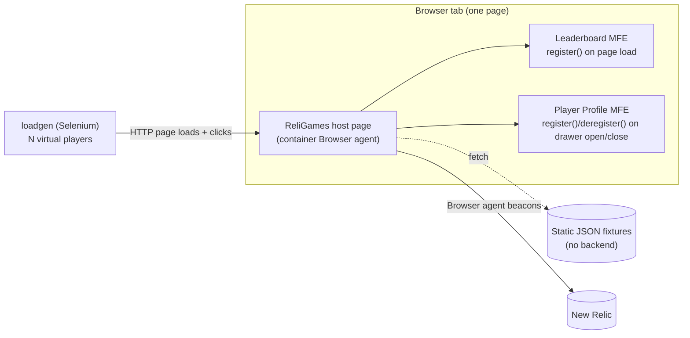

# ReliGames — Browser + Micro-Frontend Monitoring Demo

A lightweight, backend-free demo of New Relic's **Browser agent** and **Micro-Frontend (MFE) Monitoring** (preview) feature. A single host page — a live esports leaderboard for the fictional "ReliGames" — embeds two independently-built micro frontends, and a Selenium-driven load generator continuously produces realistic traffic across several simulated players.

New Relic's MFE monitoring uses a **central agent architecture**: one Browser agent runs on the container/host page, and each embedded micro frontend calls `window.newrelic.register({ id, name, tags })` to get back a scoped agent handle for its own errors, Ajax calls, custom events, logs, and interactions. See [Monitor micro frontends with Browser monitoring](https://docs-preview.newrelic.com/docs/browser/micro-frontend-monitoring) (preview docs).

> **Note:** This app is fully functional and generates continuous load with New Relic instrumentation left unconfigured — it just won't report anywhere until you fill in the `.env` values. See [Wiring up New Relic](#wiring-up-new-relic) below.

## Architecture



| Service | Role |
| --- | --- |
| `shell` | nginx-served static site: the host page + both MFE bundles |
| `loadgen` | Selenium/headless Chromium container generating page views |

## Directory structure

```
religames-browser-mfe/
├── docker-compose.yml
├── .env.example
├── shell/
│   ├── src/                     hand-written source (bundled at build time)
│   │   ├── shell.js             mounts both MFEs, wires the profile drawer
│   │   ├── mfe-leaderboard/     Leaderboard MFE source
│   │   └── mfe-profile/         Player Profile MFE source
│   ├── public/                  static assets served as-is (css, data/*.json)
│   │   └── js/newrelic-agent.js  the real compiled Browser agent, saved verbatim
│   ├── index.html.template      host page, NREUM snippet placeholders
│   ├── build.mjs                esbuild: 3 independent minified bundles + sourcemaps
│   ├── nginx.conf
│   └── docker-entrypoint.d/     envsubst templating at container start
└── loadgen/
    ├── index.js                 orchestrates N concurrent virtual players
    ├── users.js                 fixed pool of 5 {userId, appVersion} profiles
    └── journeys/                scripted user journeys
```

## Prerequisites

- Docker and Docker Compose
- (Optional, for reporting to New Relic) An NR account with a **SPA-capable** Browser app, and the register API preview enabled — see [Wiring up New Relic](#wiring-up-new-relic)

## Quick start

```bash
cd religames-browser-mfe
cp .env.example .env
docker compose up --build
```

Visit **http://localhost:8098**. The leaderboard loads immediately; click **My Profile** to open the profile drawer. The `loadgen` container starts generating simulated page views a few seconds later — watch it with:

```bash
docker compose logs -f loadgen
```

## URLs

| URL | Description |
| --- | --- |
| http://localhost:8098 | ReliGames leaderboard (host page) |
| http://localhost:8098/health | nginx health check |

## Environment variables

| Variable | Default | Description |
| --- | --- | --- |
| `NEW_RELIC_ACCOUNT_ID` | _(blank)_ | From your Browser app's copy/paste snippet |
| `NEW_RELIC_TRUST_KEY` | _(blank)_ | From your Browser app's copy/paste snippet |
| `NEW_RELIC_AGENT_ID` | _(blank)_ | From your Browser app's copy/paste snippet |
| `NEW_RELIC_LICENSE_KEY` | _(blank)_ | From your Browser app's copy/paste snippet |
| `NEW_RELIC_APPLICATION_ID` | _(blank)_ | From your Browser app's copy/paste snippet |
| `SHELL_PORT` | `8098` | Host port for the leaderboard page |
| `LOADGEN_USERS` | `3` | Concurrent virtual players (capped at 5) |
| `LOADGEN_INTERVAL_MS` | `15000` | Base delay between a virtual player's page views |

## What the app exercises

- **Leaderboard MFE** — registers once on page load, deregisters on `pagehide`. Search/filter, `AjaxRequest` (fetches `/data/leaderboard.json`), `addPageAction`, `measure()`, verbose `log()` calls, and one purposeful **uncaught** error on "Refresh Rankings" (~1 in 3 clicks) to show automatic stack-trace error attribution.
- **Player Profile MFE** — a drawer that calls `register()`/`deregister()` every time it's opened/closed, demonstrating the full lifecycle within a single page view. Match history via `AjaxRequest`, `recordCustomEvent('RewardRedeemed', ...)`, verbose `log()` calls, and one purposeful **explicit** error (`noticeError`) on an invalid reward code.
- **Container app (outside both MFEs)** — a "Simulate App Error" button in the top bar (`shell.js`, never calls `register()`) throws an uncaught error attributed to the container application itself, for testing/demonstrating non-MFE error reporting.
- **Load generator** — 5 fixed player identities, each with its own `appVersion` (simulating a canary rollout), cycling through 5 weighted journeys (including one that clicks the container error button) so `PageView`, `MicroFrontEndTiming` (including `vitals.fcp.value`, attributable per-MFE thanks to the static `data-nr-mfe-id` markup), `AjaxRequest`, `PageAction`, `UserAction`, `JavaScriptError`, `Log`, and custom events all show up continuously.

## Source maps

Each MFE bundle is shipped minified with an external sourcemap (`shell/build.mjs`), but the `.map` files are **not** served publicly — they're copied to a non-webroot path in the image instead. Pull them out for manual upload to New Relic (Errors Inbox > Sourcemaps) when you're ready:

```bash
docker compose cp shell:/usr/share/nginx/html-internal/maps/. ./shell/sourcemaps/
```

## Wiring up New Relic

The repo ships with `.env.example` blank, so a fresh clone runs with no NR reporting until you fill in your own account's values — but the snippet plumbing itself is already wired up and verified against a real account snippet, not just scaffolded:

1. In your NR account, create (or use) a **SPA-capable** Browser app, with the register API preview enabled (an account rep grants this, or it's toggled on the Browser app's Application Settings page — once enabled, the account's own exported snippet includes an `api.register` block automatically).
2. Copy the account's "Copy/Paste JS code" snippet. It has two parts, handled differently here — **do not paste the whole thing into one file**:
   - The `NREUM.init` / `NREUM.loader_config` / `NREUM.info` assignments at the top go into `shell/index.html.template`. `loader_config`/`info` are already templated with `${NEW_RELIC_*}` env placeholders — just fill in `.env`. `NREUM.init` is a copy/paste artifact: if your snippet's `init` object differs from what's currently in the template (e.g. you change Session Replay or masking settings in the account), replace the whole object wholesale rather than hand-editing individual keys.
   - Everything after the `;/*! For license information ... */` comment (the actual compiled agent, currently `nr-loader-spa-1.322.0.min.js`) is the file `shell/public/js/newrelic-agent.js`, saved byte-for-byte. Replace that file wholesale too if NR ever issues a new agent version — don't merge/diff it by hand.
   - There is no `js-agent.newrelic.com` CDN URL in this flow — the account's snippet is New Relic's fully-inlined format, not a `<script src>` reference, so there's no loader URL to configure anywhere.
3. **Keep the agent `<script>` tag synchronous.** `shell/index.html.template` loads `newrelic-agent.js` as a plain blocking `<script src>` immediately after the config block, matching the account snippet's own two-adjacent-`<script>`-tags structure. This matters: an earlier version of this loaded it via a dynamically-created `<script>` element (which defaults to async), and that let the MFEs' `register()` calls race ahead of the agent finishing to load — `register()` would exist as a function but return `undefined` until the agent's async internals caught up, silently falling back to the app's own no-op stub. Confirmed fixed by checking `window.newrelic.register(...)` at the exact moment `DOMContentLoaded` fires.
4. Session Replay masking follows whatever your account's `session_replay.mask_text_selector`/`mask_all_inputs` settings say. The Player Profile drawer's "notify me" email field carries New Relic's real `nr-mask` class (masked regardless of those settings) as a deliberate example of manually marking one sensitive field.
5. Upload the sourcemaps extracted above once errors start appearing minified in Errors Inbox.
6. In New Relic, check **Browser > Micro-Frontends** for the "Leaderboard" and "Player Profile" entities and their relationship to the container app.

## Cleanup

```bash
docker compose down -v
```
